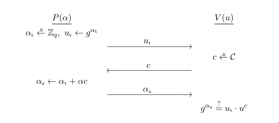

# Protocollo d'identificazione di Schnorr

Il protocollo di Schnorr è un protocollo d'identificazione dimostrato sicuro contro gli attacchi d'intercettazione (attacco passivo in cui un attaccante si limita a spiare la comunicazione tra due o più parti senza modificarne il contenuto né interferire attivamente. L'obiettivo dell'attaccante è ottenere informazioni riservate semplicemente osservando ciò che viene trasmesso). Tale protocollo si basa sull'assunzione che il problema del logaritmo discreto (**NOTA SU QUESTO PROBLEMA**) è difficile da risolvere.

Sia $\mathbb{G}$ un gruppo ciclico di ordine primo $q$ con generatore $g \in \mathbb{G}$. Supponiamo che il **Prover** $P$ abbia una chiave segreta $\alpha \in \mathbb{Z}_{q}$, e la corrispondente chiave pubblica di verifica $u = g^{\alpha} \in \mathbb{G}$. Per dimostrare la sua identità ad un **Verifier** $V$, $P$ vuole convincere $V$ di conoscere $\alpha$. Il metodo più semplice per fare ciò è quello di inviare $\alpha$ a $V$. In sostanza, questo protocollo non è altro che il protocollo di base per le password. Come tale, mentre questo protocollo è sicuro contro gli attacchi diretti, è completamente insicuro contro gli attacchi d'intercettazione.
Invece, il protocollo di Schnorr è un protocollo interattivo (**NOTA**) progettato in modo intelligente che $P$ convinca $V$ di conoscere il logaritmo discreto di $u$ con base $g$ senza inviarlo a $V$.

## Come funziona

Sia $\mathcal{C}$ un sottoinsieme di $\mathbb{Z}_{q}$, descriviamo il protocollo di Schnorr con la tripla $\mathcal{I}_{sch} = (G, P, V)$ dove:

- $G$ è l'algoritmo di generazione delle chiavi, e funziona nel seguente modo:
    $$\alpha \xleftarrow{R} \mathbb{Z}_{q},\ u \leftarrow g^{\alpha}$$
    **NOTA**: $\alpha$ è scelto uniformenente random in $\mathbb{Z}_{q}$.
    Definiamo chiave di verifica $vk := u$ e chiave segreta $sk := \alpha$.
- Il prover $P$ è inizializzato con $sk = \alpha$ e il verifier $V$ con $vk = g^{\alpha}$. Il protocollo tra $P$ e $V$ è il seguente:
  1. $P$ calcola $\alpha_{t} \xleftarrow{R} \mathbb{Z}_{q}$, $u_{t} \leftarrow g^{\alpha_{t}}$ e invia $u_{t}$ a $V$;
  2. $V$ calcola $c \xleftarrow{R} \mathcal{C}$ e lo invia a $P$;
  3. $P$ calcola $\alpha_{z} = \alpha_{t} + \alpha c \in \mathbb{Z}_{q} (\mod\ q)$ e invia $\alpha_{z}$ a $V$;
  4. $V$ verifica se $g^{\alpha_{z}} = u_{t} \cdot u^{c}$; se è vero allora *accetta* altrimenti *rigetta*.

**NOTA**: $u_{t}$ è una sorta di impegno temporale, non legato direttamente a $\alpha$
**NOTA**: $c$ è una sorta di "sfida casuale" che serve a vincolare $P$ e a evitare che prepari le risposte in anticipo, e quindi non "dimostri" davvero nulla.
**NOTA**: Il passaggio 3 è una combinazione della parte random $\alpha_{t}$ con la chiave segreta $\alpha$, pesata con la sfida $c$. È un valore misto che permette al verificatore di controllare la relazione. Infatti nella verifica, se l'uguaglianza è vera, ovvero che $P$ conosca veramete $\alpha$ acceta, altrimenti rifiuta.

### Perché funziona?

Il verifier $V$ accetta se solo se l'uguaglianza $g^{\alpha_{z}} = u_{t} \cdot u^{c}$ è vera. Sostituendo, otteniamo:
$$u_{t} \cdot u^{c} = g^{\alpha_{t}} \cdot (g^{\alpha})^c = g^{\alpha_{t} + \alpha c} = g^{\alpha_{z}}$$
Quindi se $P$ ha calcolato tutto correttamente **e conosce** $\alpha$, allora l'uguaglianza sarà vera.

L'interazione tra $P(\alpha)$ e $V(u)$ genera una *conversazione* $(u_{t}, c, \alpha_{z}) \in \mathbb{G} \times \mathcal{C} \times \mathbb{Z}_{q}$. Se l'uguaglianza $g^{\alpha_{z}} = u_{t} \cdot u^{c}$ è vera alora tale conversazione prende il nome di **conversazione accettata**.

L'insieme $\mathcal{C}$ vine chiamato **spazio delle sfide** ed è l'insieme da cui viene estratta la **sfida casuale** $c$. Per dimostrare la sicurezza del protocollo, si richiede che il numero di elementi nello delle sfide, cioè $|\mathcal{C}|$, sia super-polinomiale, cioè più grande di qualsiasi polinomio in funzione della dimensione del problema. In pratica vogliamo uno spazio di sfide molto grande così da rendere impossibile un attacco diretto (brute force). In effetti potremmo semplicemente definire lo spazio delle sfide come $\mathbb{Z}_{q}$ ma a volte, per convenienza tecnica, si può usare uno spazio un pò più piccolo, purché resti abbastanza grande da garantire la sicurezza.

